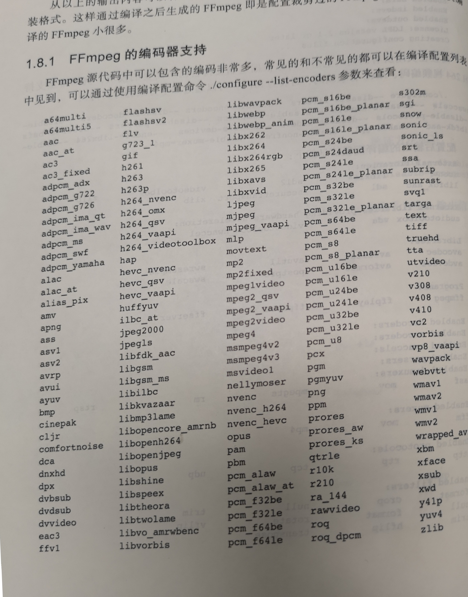
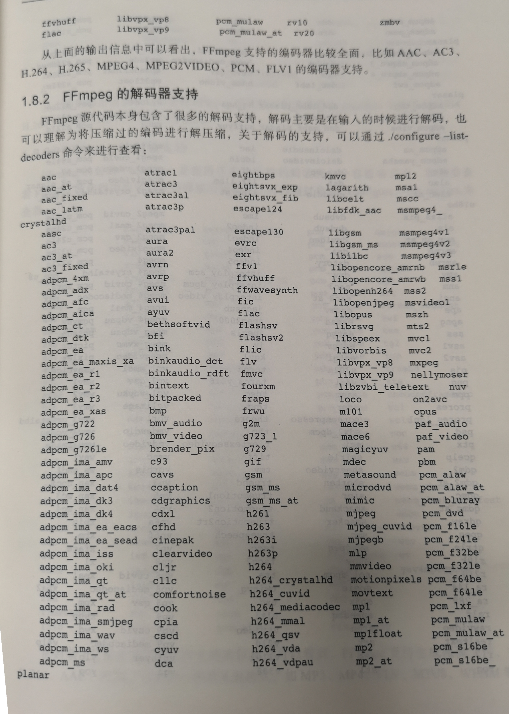
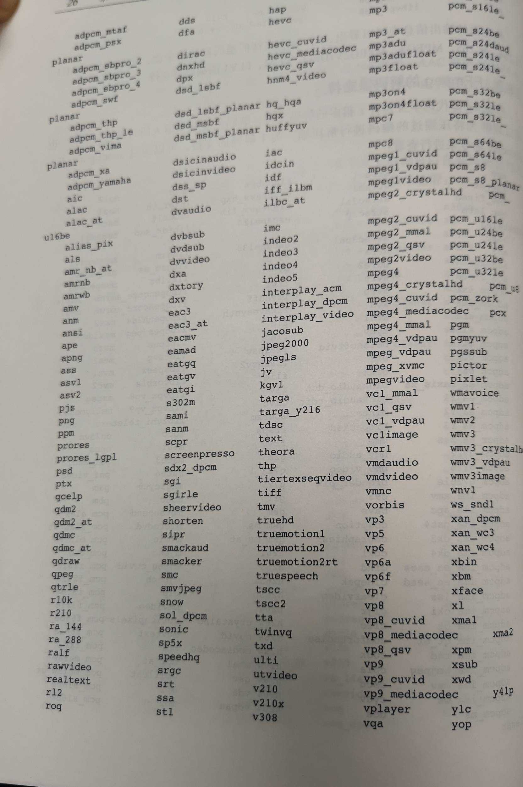
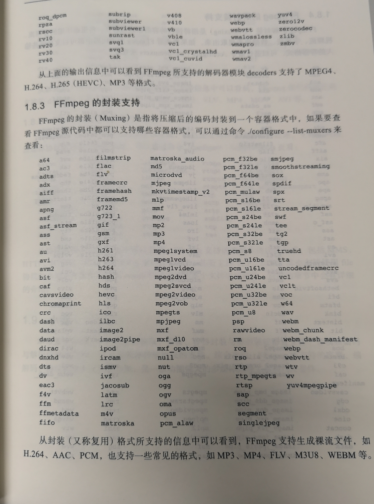
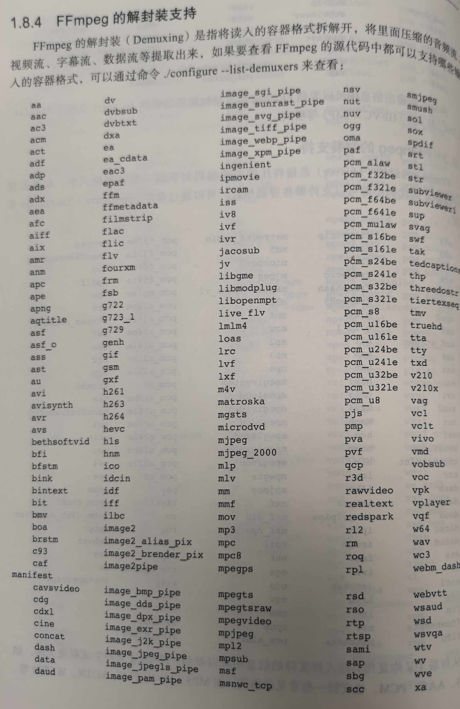
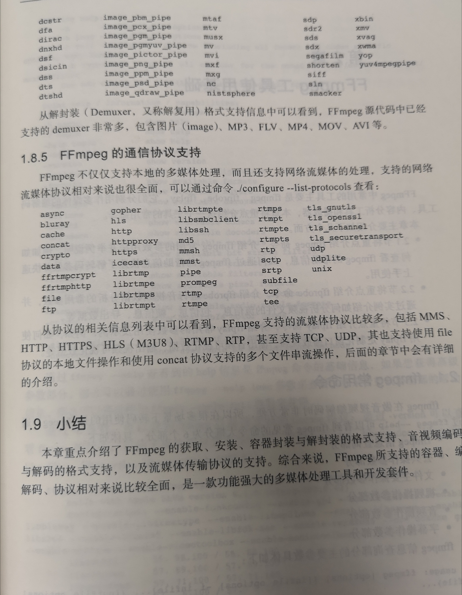

### <font color="#ffcc77">模块 media-ijk 是基于 FFPMEG 编译的</font>

---------
- 出于 so 大小考虑，普通编译 so 只支持了常用的视频编码，如果需要支持额外类型，可重新编译 ijkplayer 源码，配置 module.sh 然后编译 so，替换现在项目中的 so，注意 so 的版本要和 ijk 的 java 版本一致。
---------

#### <font color="#ff99aa">说明：</font>如果出现有声音没画面，或者有画面没声音的异常情况，请先了解以下内容。

- 简单来说，mp4 并不是视频编码，可以称为视频容器，而 H264/H263 等这样才是视频编码，AAC 为音频编码等。

- 对于视频相关的，推荐雷宵骅的视频基础 <font color="#cc7722">[视音频编解码技术零基础学习方法]( http://blog.csdn.net/leixiaohua1020/article/details/18893769 )</font>，这里你可以了解到视频和音频相关编码和协议的东西。

- 项目普通 so 默认支持的视频编码和音频编码配置可查看 <font color="#cc7722">[编译配置文件 module-lite-car.sh]( ../media-ijk/config/module-lite-car.sh )</font>：<br/>
  

### <font color="#00cccc">常用音频编译方式小结</font>

#### 支持 mp3
```
    --enable-libmp3lame 
    --enable-decoder=mp3 
    --enable-demuxer=mp3 
    --enable-muxer=mp3
    --enable-encoder=libmp3lame
```  

#### 支持 vorbis
```  
    --enable-libvorbis 
    --enable-parser=vorbis 
    --enable-encoder=vorbis 
    --enable-decoder=vorbis 
    --enable-encoder=libvorbis 
    --enable-decoder=libvorbis 
    --enable-muxer=ogg
    --enable-demuxer=ogg
```  

#### 支持 wav
```  
    --enable-libwavpack
    --enable-muxer=wav
    --enable-demuxer=wav
    --enable-decoder=wavpack
    --enable-encoder=wavpack
    --enable-decoder=wav
    --enable-encoder=wav
    --enable-encoder=pcm_s16le
    --enable-decoder=pcm_s16le

    --enable-encoder=pcm_u8
    --enable-decoder=pcm_u8
    --enable-muxer=pcm_u8
    --enable-demuxer=pcm_u8  
```

#### 支持 aac
```
    --enable-libvo-aacenc
    --enable-libfdk_aac
    --enable-libfaac
    --enable-parser=aac
    --enable-encoder=aac
    --enable-decoder=aac
    --enable-encoder=libfaac
    --enable-encoder=libvo_aacenc
    --enable-encoder=libaacplus
    --enable-encoder=libfdk_aac
    --enable-decoder=libfdk_aac
    --enable-demuxer=aac
    --enable-muxer=adts
```

#### 支持 mp2
```
    --enable-encoder=mp2 
    --enable-decoder=mp2 
    --enable-muxer=mp2 
    --enable-decoder=mp2float 
    --enable-encoder=mp2fixed 
```

#### flac 支持
```
    --enable-encoder=flac
    --enable-decoder=flac
    --enable-demuxer=flac
    --enable-muxer=flac
    --enable-parser=flac
```
#### jpeg 等
```
    --enable-encoder=jpeg2000 
    --enable-encoder=mjpeg 
    --enable-encoder=ljpeg 
    --enable-encoder=jpegls
    --enable-decoder=jpeg2000 
    --enable-decoder=jpegls 
    --enable-decoder=mjpeg 
    --enable-decoder=mjpegb 
    --enable-muxer=mjpeg 
    --enable-demuxer=mjpeg 
    --enable-encoder=png 
    --enable-decoder=png 
    --enable-parser=png 
```

#### 添加 scale 的支持
```
    --enable-swscale 
    --enable-swscale-alpha 
    --enable-filter=scale 
```

#### ac3 支持
```
    --enable-encoder=ac3 
    --enable-decoder=ac3 
    --enable-encoder=ac3_fixed
    --enable-decoder=atrac3 
    --enable-decoder=atrac3p 
    --enable-encoder=eac3 
    --enable-decoder=eac3 
    --enable-muxer=ac3 
    --enable-demuxer=ac3 
    --enable-muxer=eac3 
    --enable-demuxer=eac3 
```

#### 支持 wma/wmv
```
    --enable-decoder=wmalossless 
    --enable-decoder=wmapro 
    --enable-encoder=wmav1 
    --enable-decoder=wmav1 
    --enable-encoder=wmav2 
    --enable-decoder=wmav2 
    --enable-decoder=wmavoice 
    --enable-demuxer=xwma 
    --enable-demuxer=avi 
    --enable-muxer=avi 
    --enable-demuxer=asf 
    --enable-muxer=asf 
    --enable-encoder=wmv1
    --enable-decoder=wmv1 
    --enable-encoder=wmv2 
    --enable-decoder=wmv2 
    --enable-decoder=wmv3 
    --enable-decoder=wmv3_crystalhd 
    --enable-decoder=wmv3_vdpau 
    --enable-decoder=wmv3image 
```

### <font color="#00cccc">ffmpeg 支持的编码，解码，容器等格式如下图</font>
<br/>
<br/>
<br/>
<br/>
<br/>
<br/>